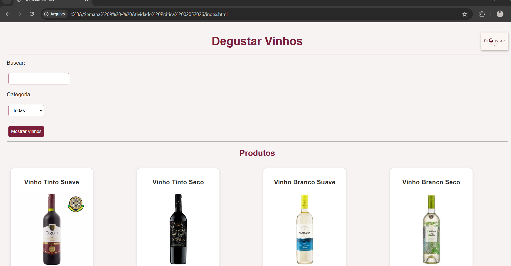
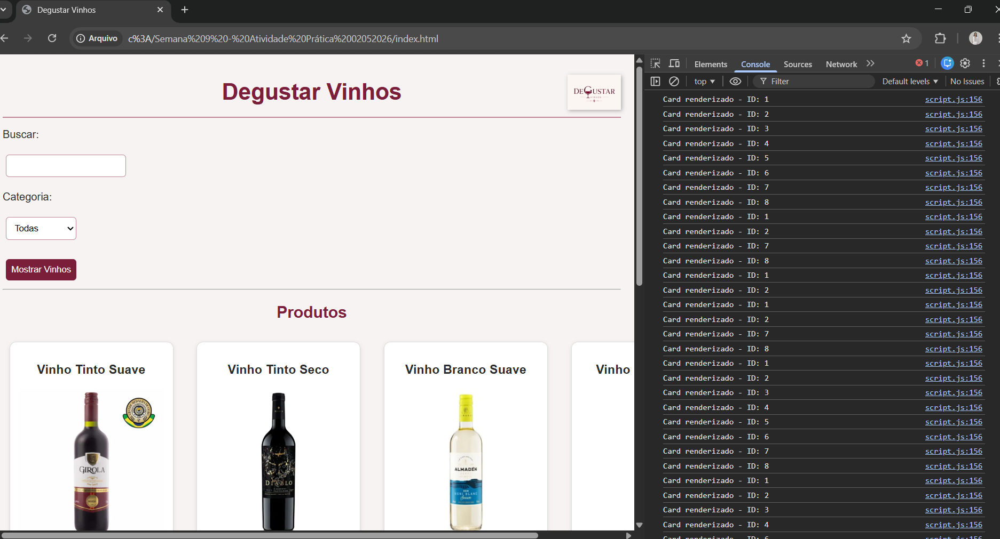

Atividade Prática - Introdução à Computação

Nome:Patricia Souza  
Matrícula:** 901262  
Curso:Tecnologia  
Projeto:Catálogo de Vinhos 

Descrição
Desenvolvimento de uma interface dinâmica para exibição e filtragem de produtos (vinhos e espumantes), aplicando conceitos de manipulação de DOM e lógica de programação com JavaScript.

Funcionalidades
Renderização dinâmica de 8 produtos a partir de um objeto JSON.
Filtro por busca de texto e por categoria.
Botão de detalhes e sistema de destaque do card.
Log de IDs no console conforme exigido pelo enunciado.

Tecnologias
 HTML5 / CSS3 / JavaScript
Git e GitHub para controle de versão

Prints do projeto

Catálogo de Vinhos (tela principal)

Console do navegador
